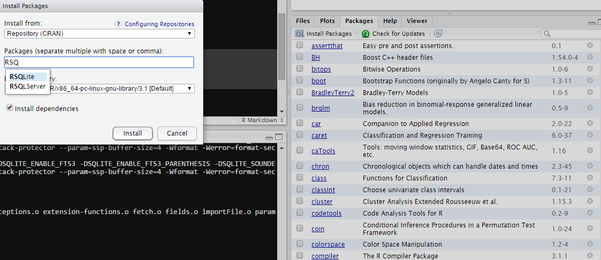

```{r, include = FALSE}
#opts_chunk$set(out.width='1024px',out.height='768px', dpi=200)
#source("tools/chunk-options.R")
```

# Learning objectives

* Begin to automate processes
* Regenerate our database from the original data files


# Building a Workflow - Part 1

*


### Getting our data 


```{r}

getwd()

list.files("../datacarpentry/data/biology/")

```

If we use the F1 key to get some help on the list.files function we can peruse its documentation. We can also use `??list.files`

```{r}


list.files("../datacarpentry/data/biology/", pattern='csv')

filelist <- list.files("../datacarpentry/data/biology/", pattern='csv')

```


Our file list has two extra files that don't belong in our data set so lets try and get rid of them.

We'll use our local neighborhood 'grep' to try and find the '_' character so that we can remove those two files we do not desire.

```{r}
grep('_', filelist)

```

`grep('_', filelist)` Gives us the expression indicating the indices of which members of `filelist` contain the character '_'.

So what we are looking for is something like:

```{r}
filelist[c(-1,-4)]
```

Why might using these *static* indices be a bad idea? What could make the expression `filelist[c(-1,-4)]` work improperly?


We'll use this expression to obtain the list of files that we desire in a more dynamic fashion:

```{r}
filelist <- filelist[ !( filelist %in% filelist[grep('_',filelist)] ) ]
```


Now that we have a list of our csv files we want to read them all into our database that we had during our SQL lesson so that our data is in a tidy format.

In order to complete that task we need to do a few things first:
1. Load a library that will allow us to connect to a SQLite database
2. Read all the csv files in our list of csv files and then insert them as tables into the SQLite database.


# Packages

There are many ways to interface with a database. The first package to use is the package "RSQLite" which provides us a way to talk to our database.Another popular package for interfacing with a SQLite database is the "sqldf" package. "sqldf" can also interface with other types of databases. 

Like all things programmings, there are many ways to get the job done. "RSQLite" will be our first tool we use.

First lets install our package and make load the library. We can only begin to use functions from this package after we have loaded it so we need to make sure that the package is included in our work flow.  (More on package dependencies later.)

```{r}
#install the package
usePackage <- function(p) {
    if (!is.element(p, installed.packages()[,1]))
        install.packages(p, dep = TRUE)
    require(p, character.only = TRUE)
}


#load the package
usePackage('RSQLite')
```

One could also use the RStudio Gui to install this package:



### However why might you want to use the `install.packages()` function?


# RSQLite

First we need to create a database:
```{r}

db <- dbConnect(SQLite(), dbname="data/portal_mammals.sqlite")

```

Per the documentation on dbConnect from "RSQLite" the dbConnect function will create a database for us at the file path specified. ( There are many advanced options like in memory databases as well.)

Now that we have this database let us experiment with the library and interacting with the database.

some key functions avaiable in this package:


```{r eval =FALSE}
#Raw query functions
dbSendQuery()
dbGetQuery()

#informational queries
dbListTables()
dbListFields()

#some shortcut queries
dbReadTable()
dbRemoveTable()

```

(Some examples politely borrowed from http://sandymuspratt.blogspot.com/2012/11/r-and-sqlite-part-1.html)


### Create a table in the database
```{r}
 dbSendQuery(conn = db,
       "CREATE TABLE School
       (SchID INTEGER,
        Location TEXT,
        Authority TEXT,
        SchSize TEXT)")
```

# Insert some data into that table
```{r}

dbSendQuery(conn = db,
         "INSERT INTO School
         VALUES (1, 'urban', 'state', 'medium')")
 dbSendQuery(conn = db,
         "INSERT INTO School
         VALUES (2, 'urban', 'independent', 'large')")
 dbSendQuery(conn = db,
         "INSERT INTO School
         VALUES (3, 'rural', 'state', 'small')")
 
```

# List the tables. List the fields. 
```{r}
 dbListTables(db)              # The tables in the database
 dbListFields(db, "School")    # The columns in a table
 dbReadTable(db, "School")     # The data in a table
```

# Bring the `school` table into R
```{r}
School <- dbGetQuery(db, "SELECT * from School")  
School <- dbReadTable(db, "School")     
```

## Notice
* The difference between the `dbGetQuery()` and `dbSendQuery()`
* See how the `dbReadTable()` function does some work for us.

Now lets get rid of this test table. Creating the tables manually is a bit tedious, and hardly a practical way to go about creating our database.

```{r}
dbRemoveTable(db, "School")     # Remove the School table.
rm(School)
```


#Functions

Now in order to recreate our SQL database from the SQL lesson we would like to:

1. copy our data into the data folder so that our work includes the original data
2. Read that csv into a table
3. Insert that table into the database

We have to do this for every file in our list. While not very daunting, it makes sense for use to try and automate this procedure so we don't have to copy/paste our code. (What if we had x1000 files we needed to read? Or even x20?)

If you every find yourself copy pasting, or repeating yourself, there might be a more elegant solution. 


#copy our data file into the data directory

So most of the time we might be retrieving data from the internet or some other location. In this excercise it will merely be from another directory, however it is wise to document where your data came from explicitly. That way there is as direct a link as possible to its origin to trace errors or subsequent findings.

Lets see how we copy our files to a new directory:
```{r}
dir.create("data/raw")

file.copy("../datacarpentry/data/biology/plots.csv", "data/raw/")
```

Alright that does one of our files, but we have many so lets do all of them now.

```{r}
#whoops this fails. What is wrong here?
file.copy(filelist, "data/raw/")

# much better here
file.copy(paste0('../datacarpentry/data/biology/',filelist), "data/raw/")

```


Now we could perform this code to write our data into our database:

```{r}
dbWriteTable(db, name= "plots"  , value = "data/raw/plots.csv"  , row.names = FALSE, header = TRUE)
dbWriteTable(db, name= "surveys", value = "data/raw/surveys.csv", row.names = FALSE, header = TRUE)
dbWriteTable(db, name= "species", value = "data/raw/species.csv", row.names = FALSE, header = TRUE) 
dbListTables(db)
```

Which is perfectly effective. However again imagine if we had several hundred tables. It would become quickly more cumbersome.

Remember how I said there may be another way? R loves working with lists or vectors of things. 

Here is an example of a loop that will do our work for us also:
```{r}

#lets get some plain table names first:

#gsub()  will find "something" in a string and replace it with "something else"
#gsub("something", "something else", string_vector)
tablenames <- gsub(".csv", "", filelist)
datadir    <- 'data/raw/'


for (i in length(filelist)) {

  dbWriteTable(db, name= tablenames[i], value = paste0(datadir, filelist[i]), row.names = FALSE, header = TRUE, overwrite = TRUE ) 
  
}

dbListTables(db)
```

However there is an even more elegant way to write this last bit of code. 

In R remember our `apply` function is often our best friend. 

`apply` likes to apply the same function on each piece of the data. 

1.`apply` works with rows or columns in a data.frame or matrix.
2.`lapply` when you want to use the same function on every element in a list.
3.`sapply` when you want to use the same function on every element in a list and get a vector back.
4. and more!  
    - see [this](http://stackoverflow.com/questions/3505701/r-grouping-functions-sapply-vs-lapply-vs-apply-vs-tapply-vs-by-vs-aggrega) article for some more info or stay tuned for more advanced apply lessons.
     
```{r}

tablenames <- gsub(".csv", "", filelist)
datadir    <- 'data/raw/'

lapply(filelist, function(x) dbWriteTable(db, name = gsub(".csv", "",x ), value=paste0(datadir,x ), row.names = FALSE, header = TRUE, overwrite = TRUE )  )  


```

While elegant, it sure packs a lot into one line. So it is okay to seperate things out if it makes for easier clarity and understanding of what the code is supposed to do. 

Remember: Write programs for people not for computers! 


# Analysis and Reporting


```{r}


usePackage('dplyr')

portal_mammals <- src_sqlite( "data/portal_mammals.sqlite" )
plots <- tbl(portal_mammals, "plots")

types <- dbGetQuery(db, "SELECT DISTINCT(plot_type) FROM plots")


type <- types[1,1]


dbListTables(db)


surveys <- read.csv(file="data/raw/surveys.csv")
dbWriteTable(db,"surveys", surveys, overwrite = T)

plots <- read.csv(file="data/raw/plots.csv")
dbWriteTable(db,"plots", plots, overwrite = T)

species <-read.csv(file="data/raw/species.csv")
dbWriteTable(db,"species", species, overwrite = T)


library(ggplot2)

plotdata <- dbGetQuery(db, "SELECT surveys.year,surveys.species
                            FROM surveys")

plotplot <- ggplot(na.omit(plotdata), aes(x = year, fill = species )) + 
  geom_bar()

plot(plotplot)

plotdata <- dbGetQuery(db, "SELECT surveys.year,surveys.species,plots.plot_type
                            FROM surveys
                            LEFT JOIN plots
                            ON surveys.plot=plots.plot_id")

plotplot <- ggplot(na.omit(plotdata), aes(x = year, fill = species )) + 
  geom_density(alpha = .7) +
  facet_grid( . ~ plot_type)

plot(plotplot)

taxaplotdata <- dbGetQuery(db, "SELECT surveys.year,surveys.species, plots.plot_type, species.taxa
                            FROM surveys
                            LEFT JOIN plots
                            ON surveys.plot=plots.plot_id
                            LEFT JOIN species
                            ON surveys.species = species.species_id")


#png(filename = "taxaplot.png", width = 1024, height = 768, units = "px")

taxaplot <-  ggplot(na.omit(taxaplotdata), aes(x = year, fill = species )) + 
  geom_density(alpha = .7) +
  facet_grid( taxa ~ plot_type) +
  guides(fill=FALSE) + 
  theme(text = element_text(size=8), axis.text.x = element_text(angle=90, vjust=1)) 

#dev.off()
ggsave("img/taxaplot.png",height=4.5,width=6,dpi=300)


#plot(taxaplot)

dbDisconnect(db)

```


Functions work like functions in math: (from http://en.wikipedia.org/wiki/Function_(mathematics))


In R you have:

```{r eval = FALSE}
name_of_my_function <- function(inputs_here, can_have, more_than, one_input, seperated_by_commas, ...){
  
  #Do stuff to your inputs in your function here!
  
  return(output_of_my_function)
}

```


